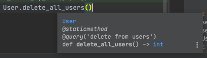

# Data Access Object (DAO)

This is kind of a raw idea but very clean in sense of usage purposes.
Let's say you'd like to have typed objects after fetching them from DB,
and you want them to be converted automatically. To implement that you'll
need to describe models in code, define their methods, convert them to
necessary objects etc.

To avoid that you can simply define your models as dataclasses, define
methods with respective data types (annotate them) and queries, so you're
halfway there. IDEs will highlight you methods with their queries.



You would also need to define what cursor must that DAO use with implemented
`.execute()`, `.fetchall()` and `.mogrify()` methods.

## Usage

```python
import datetime

from dataclasses import dataclass
from typing import List

from useless_examples.data_access_object.data_access_object import db_connector, query


def get_cursor():
    """Return cursor to your db which implements .execute(), .fetchall() and .mogrify()"""
    pass


@db_connector(get_cursor)
@dataclass
class User:
    id: int
    name: str
    dob: datetime.date

    @staticmethod
    @query('select * from users where id in %(user_ids)s')
    def get_users_by_ids(user_ids: List[int]) -> List['User']:
        pass

    @staticmethod
    @query('delete from users')
    def delete_all_users() -> int:
        pass


assert [
    User(1, 'Alice', datetime.date(1970, 1, 1)),
    User(2, 'Bob', datetime.date(1970, 1, 1)),
] == User.get_users_by_ids([1, 2])
assert 2 == User.delete_all_users()
```
